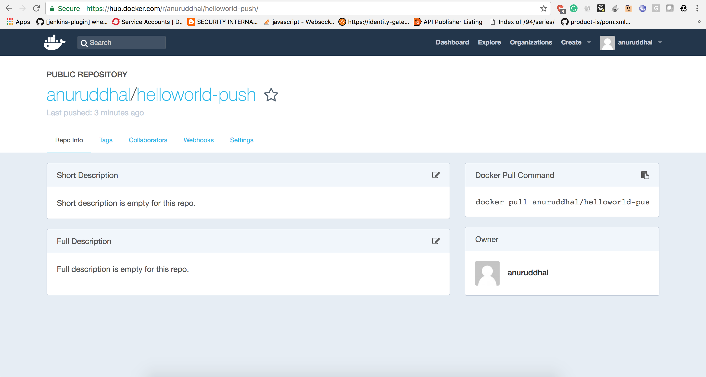

## Sample3: Push docker image to docker registry

- This sample creates a docker image and push it to docker registry. 

- Following artifacts will be generated from this sample.
    ``` 
    $> docker images
    anuruddhal/helloworld-push:v2.0.0
    
    $> tree
    ├── docker_push_sample.balx
    └── target
        └── docker
            └── Dockerfile
    ```
### How to run:

1. Open docker_push_sample.bal file and change the username and password attributes.
```bash
@docker:DockerConfig {
    push:true,
    registry:"index.docker.io/<username>",
    name:"helloworld-push",
    tag:"v2.0.0",
    username:"<username>",
    password:"<password>"
}
```

2. Compile the  docker_push_sample.bal file. 
```bash
$> ballerina build docker_push_sample.bal

success: Successfully built 70a5e621b84d

info: Successfully tagged anuruddhal/helloworld-push:v2.0.0

info: The push refers to repository [docker.io/anuruddhal/helloworld-push]
info: v2.0.0: digest: sha256:cd4f50afd4bd720025cc590cd4b1f6b06f35bfc468fdfb471cd3dd069879cee1 size: 1368
success: Done.

Run following command to start docker container: 
docker run -d -p 9090:9090 index.docker.io/anuruddhal/helloworld-push:v2.0.0
```

3. hello-world-docker.balx, Dockerfile and docker image will be generated: 
```bash
$> tree
.
├── README.md
├── docker_push_sample.bal
├── docker_push_sample.balx
└── target
    └── docker
        └── Dockerfile
```

4. Verify the docker image is created:
```bash
$> docker images
REPOSITORY                        TAG                 IMAGE ID            CREATED             SIZE
anuruddhal/helloworld-push        v2.0.0              70a5e621b84d        2 minutes ago       102MB
```

5. Login to https://hub.docker.com/ and verify image is pushed.

